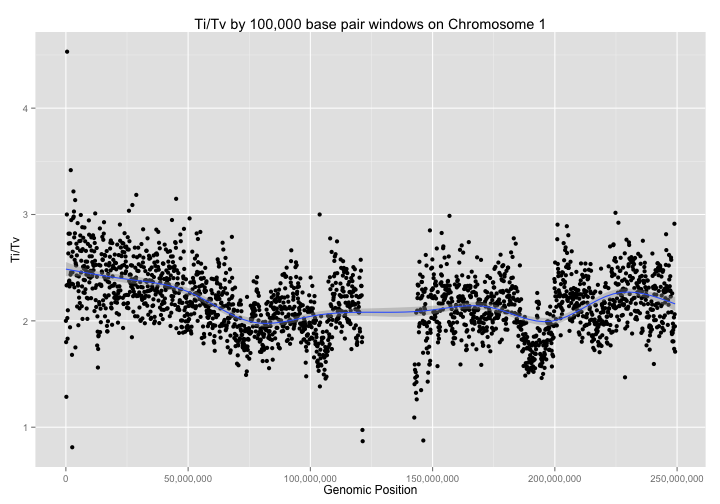

<!-- R Markdown Documentation, DO NOT EDIT THE PLAIN MARKDOWN VERSION OF THIS FILE -->

<!-- Copyright 2015 Google Inc. All rights reserved. -->

<!-- Licensed under the Apache License, Version 2.0 (the "License"); -->
<!-- you may not use this file except in compliance with the License. -->
<!-- You may obtain a copy of the License at -->

<!--     http://www.apache.org/licenses/LICENSE-2.0 -->

<!-- Unless required by applicable law or agreed to in writing, software -->
<!-- distributed under the License is distributed on an "AS IS" BASIS, -->
<!-- WITHOUT WARRANTIES OR CONDITIONS OF ANY KIND, either express or implied. -->
<!-- See the License for the specific language governing permissions and -->
<!-- limitations under the License. -->

# Part 4: Variant-Level QC


In Part 4 of the codelab, we perform some quality control analyses that could help to identify any problematic variants which should be excluded from further analysis.  The appropriate cut off thresholds will depend upon the input dataset and/or other factors.

* [Ti/Tv by Genomic Window](#titv-by-genomic-window)
* [Ti/Tv by Alternate Allele Counts](#titv-by-alternate-allele-counts)
* [Missingness Rate](#missingness-rate)
* [Hardy-Weinberg Equilibrium](#hardy-weinberg-equilibrium)
* [Heterozygous Haplotype](#heterozygous-haplotype)

By default this codelab runs upon the Illumina Platinum Genomes Variants. Update the table and change the source of sample information here if you wish to run the queries against a different dataset.

```r
#tableReplacement <- list("_THE_TABLE_"="genomics-public-data:platinum_genomes.variants",
#                          "_THE_EXPANDED_TABLE_"="google.com:biggene:platinum_genomes.expanded_variants")
#sampleData <- read.csv("http://storage.googleapis.com/genomics-public-data/platinum-genomes/other/platinum_genomes_sample_info.csv")
#sampleInfo <- select(sampleData, call_call_set_name=Catalog.ID, gender=Gender)

tableReplacement <- list("_THE_TABLE_"="google.com:biggene:test.pgp_variants_20150205",
                         "_THE_EXPANDED_TABLE_"="google.com:biggene:test.pgp_variants_20150205_expanded")
sampleData <- read.csv(textConnection(getURL("https://my.pgp-hms.org/google_surveys/1/download")))
sampleInfo <- select(sampleData, call_call_set_name=Participant, gender=Sex.Gender)
```
## Ti/Tv by Genomic Window

Check whether the ratio of transitions vs. transversions in SNPs appears to be reasonable in each window of genomic positions.  This query may help identify problematic regions.


```r
result <- DisplayAndDispatchQuery("./sql/ti-tv-ratio.sql",
                                  project=project,
                                  replacements=c(tableReplacement,
                                                 "#_WHERE_"="WHERE reference_name='chr1'",
                                                 "_WINDOW_SIZE_"="100000"))
```

```
# Compute the Ti/Tv ratio for variants within genomic region windows.
SELECT
  reference_name,
  window * 100000 AS window_start,
  transitions,
  transversions,
  transitions/transversions AS titv,
  num_variants_in_window,
FROM (
  SELECT
    reference_name,
    window,
    SUM(mutation IN ('A->G', 'G->A', 'C->T', 'T->C')) AS transitions,
    SUM(mutation IN ('A->C', 'C->A', 'G->T', 'T->G',
                     'A->T', 'T->A', 'C->G', 'G->C')) AS transversions,
    COUNT(mutation) AS num_variants_in_window
  FROM (
    SELECT
      reference_name,
      INTEGER(FLOOR(start / 100000)) AS window,
      CONCAT(reference_bases, CONCAT(STRING('->'), alternate_bases)) AS mutation,
      COUNT(alternate_bases) WITHIN RECORD AS num_alts,
    FROM
      [google.com:biggene:test.pgp_variants_20150205]
    # Optionally add clause here to limit the query to a particular
    # region of the genome.
    WHERE reference_name='chr1'
    HAVING
      # Skip 1/2 genotypes _and non-SNP variants
      num_alts = 1
      AND reference_bases IN ('A','C','G','T')
      AND alternate_bases IN ('A','C','G','T'))
  GROUP BY
    reference_name,
    window)
ORDER BY
  window_start
```
Number of rows returned by this query: 2280.

Displaying the first few results:
<!-- html table generated in R 3.1.2 by xtable 1.7-4 package -->
<!-- Fri Feb 20 09:49:40 2015 -->
<table border=1>
<tr> <th> reference_name </th> <th> window_start </th> <th> transitions </th> <th> transversions </th> <th> titv </th> <th> num_variants_in_window </th>  </tr>
  <tr> <td> chr1 </td> <td align="right">   0 </td> <td align="right"> 308 </td> <td align="right"> 154 </td> <td align="right"> 2.00 </td> <td align="right"> 462 </td> </tr>
  <tr> <td> chr1 </td> <td align="right"> 100000 </td> <td align="right">  81 </td> <td align="right">  45 </td> <td align="right"> 1.80 </td> <td align="right"> 126 </td> </tr>
  <tr> <td> chr1 </td> <td align="right"> 200000 </td> <td align="right">  45 </td> <td align="right">  35 </td> <td align="right"> 1.29 </td> <td align="right">  80 </td> </tr>
  <tr> <td> chr1 </td> <td align="right"> 300000 </td> <td align="right">  28 </td> <td align="right">  12 </td> <td align="right"> 2.33 </td> <td align="right">  40 </td> </tr>
  <tr> <td> chr1 </td> <td align="right"> 400000 </td> <td align="right">  42 </td> <td align="right">  14 </td> <td align="right"> 3.00 </td> <td align="right">  56 </td> </tr>
  <tr> <td> chr1 </td> <td align="right"> 500000 </td> <td align="right"> 367 </td> <td align="right">  81 </td> <td align="right"> 4.53 </td> <td align="right"> 448 </td> </tr>
   </table>

Visualizing the results:

```r
ggplot(result, aes(x=window_start, y=titv)) +
  geom_point() +
  stat_smooth() +
  scale_x_continuous(labels=comma) +
  xlab("Genomic Position") +
  ylab("Ti/Tv") +
  ggtitle("Ti/Tv by 100,000 base pair windows on Chromosome 1")
```



## Ti/Tv by Alternate Allele Counts

Check whether the ratio of transitions vs. transversions in SNPs appears to be resonable across the range of rare variants to common variants.  This query may help to identify problems with rare or common variants.


```r
result <- DisplayAndDispatchQuery("./sql/ti-tv-by-alternate-allele-count.sql",
                                  project=project,
                                  replacements=c(tableReplacement))
```

```
# Compute the Ti/Tv ratio for variants binned by alternate allele count.
SELECT
  transitions,
  transversions,
  transitions/transversions AS titv,
  alternate_allele_count
FROM (
  SELECT
    SUM(mutation IN ('A->G', 'G->A', 'C->T', 'T->C')) AS transitions,
    SUM(mutation IN ('A->C', 'C->A', 'G->T', 'T->G',
                     'A->T', 'T->A', 'C->G', 'G->C')) AS transversions,
    alternate_allele_count
  FROM (
    SELECT
      CONCAT(reference_bases, CONCAT(STRING('->'), alternate_bases)) AS mutation,
      COUNT(alternate_bases) WITHIN RECORD AS num_alts,
      SUM(call.genotype = 1) WITHIN RECORD AS alternate_allele_count,
    FROM
      [google.com:biggene:test.pgp_variants_20150205]
    # Optionally add clause here to limit the query to a particular
    # region of the genome.
    #_WHERE_
    HAVING
      # Skip 1/2 genotypes _and non-SNP variants
      num_alts = 1
      AND reference_bases IN ('A','C','G','T')
      AND alternate_bases IN ('A','C','G','T'))
  GROUP BY
    alternate_allele_count)
ORDER BY
  alternate_allele_count DESC
```
Number of rows returned by this query: 380.

Displaying the first few results:
<!-- html table generated in R 3.1.2 by xtable 1.7-4 package -->
<!-- Fri Feb 20 09:49:45 2015 -->
<table border=1>
<tr> <th> transitions </th> <th> transversions </th> <th> titv </th> <th> alternate_allele_count </th>  </tr>
  <tr> <td align="right"> 52835 </td> <td align="right"> 24964 </td> <td align="right"> 2.12 </td> <td align="right"> 380 </td> </tr>
  <tr> <td align="right"> 12757 </td> <td align="right"> 5767 </td> <td align="right"> 2.21 </td> <td align="right"> 379 </td> </tr>
  <tr> <td align="right"> 21957 </td> <td align="right"> 10254 </td> <td align="right"> 2.14 </td> <td align="right"> 378 </td> </tr>
  <tr> <td align="right"> 9589 </td> <td align="right"> 4410 </td> <td align="right"> 2.17 </td> <td align="right"> 377 </td> </tr>
  <tr> <td align="right"> 11163 </td> <td align="right"> 5233 </td> <td align="right"> 2.13 </td> <td align="right"> 376 </td> </tr>
  <tr> <td align="right"> 6986 </td> <td align="right"> 3166 </td> <td align="right"> 2.21 </td> <td align="right"> 375 </td> </tr>
   </table>

Visualizing the results:

```r
ggplot(result, aes(x=alternate_allele_count, y=titv)) +
  geom_point() +
  stat_smooth() +
  scale_x_continuous(labels=comma) +
  xlab("Total Number of Sample Alleles with the Variant") +
  ylab("Ti/Tv") +
  ggtitle("Ti/Tv by Alternate Allele Count")
```


## Missingness Rate

For each variant, compute the missingness rate.  This query can be used to identify variants with a poor call rate.


```r
sortAndLimit <- "ORDER BY missingness_rate DESC, reference_name, start, reference_bases, alternate_bases LIMIT 1000"
result <- DisplayAndDispatchQuery("./sql/variant-level-missingness.sql",
                                  project=project,
                                  replacements=c(tableReplacement,
                                                 "#_ORDER_BY_"=sortAndLimit))
```

```
# Compute the ratio no-calls for each variant.
SELECT
  reference_name,
  start,
  END,
  reference_bases,
  alternate_bases,
  no_calls,
  all_calls,
  (no_calls/all_calls) AS missingness_rate
FROM (
  SELECT
    reference_name,
    start,
    END,
    reference_bases,
    GROUP_CONCAT(alternate_bases) WITHIN RECORD AS alternate_bases,
    SUM(call.genotype == -1) WITHIN RECORD AS no_calls,
    COUNT(call.genotype) WITHIN RECORD AS all_calls,
  FROM
      [google.com:biggene:test.pgp_variants_20150205_expanded]
    # Optionally add clause here to limit the query to a particular
    # region of the genome.
    #_WHERE_
  )
# Optionally add a clause here to sort and limit the results.
ORDER BY missingness_rate DESC, reference_name, start, reference_bases, alternate_bases LIMIT 1000

Running query:   RUNNING  2.5s
Running query:   RUNNING  3.2s
```
Number of rows returned by this query: 1000.

Displaying the first few results:
<!-- html table generated in R 3.1.2 by xtable 1.7-4 package -->
<!-- Fri Feb 20 09:49:51 2015 -->
<table border=1>
<tr> <th> reference_name </th> <th> start </th> <th> END </th> <th> reference_bases </th> <th> alternate_bases </th> <th> no_calls </th> <th> all_calls </th> <th> missingness_rate </th>  </tr>
  <tr> <td> chr1 </td> <td align="right"> 147831142 </td> <td align="right"> 147831143 </td> <td> T </td> <td> C </td> <td align="right"> 378 </td> <td align="right"> 379 </td> <td align="right"> 1.00 </td> </tr>
  <tr> <td> chr10 </td> <td align="right"> 52320312 </td> <td align="right"> 52320313 </td> <td> T </td> <td> C </td> <td align="right"> 378 </td> <td align="right"> 379 </td> <td align="right"> 1.00 </td> </tr>
  <tr> <td> chr10 </td> <td align="right"> 54004537 </td> <td align="right"> 54004538 </td> <td> C </td> <td> T </td> <td align="right"> 378 </td> <td align="right"> 379 </td> <td align="right"> 1.00 </td> </tr>
  <tr> <td> chr10 </td> <td align="right"> 56469370 </td> <td align="right"> 56469371 </td> <td> C </td> <td> T </td> <td align="right"> 378 </td> <td align="right"> 379 </td> <td align="right"> 1.00 </td> </tr>
  <tr> <td> chr10 </td> <td align="right"> 91654409 </td> <td align="right"> 91654410 </td> <td> T </td> <td> A </td> <td align="right"> 378 </td> <td align="right"> 379 </td> <td align="right"> 1.00 </td> </tr>
  <tr> <td> chr11 </td> <td align="right"> 25672970 </td> <td align="right"> 25672971 </td> <td> C </td> <td> G </td> <td align="right"> 378 </td> <td align="right"> 379 </td> <td align="right"> 1.00 </td> </tr>
   </table>

## Hardy-Weinberg Equilibrium

For each variant, compute the expected versus observed relationship between allele frequencies and genotype frequencies per the Hardy-Weinberg Equilibrium.


```r
sortAndLimit <- "ORDER BY ChiSq DESC, reference_name, start, alternate_bases LIMIT 1000"
result <- DisplayAndDispatchQuery("./sql/hardy-weinberg.sql",
                                  project=project,
                                  replacements=c(tableReplacement,
                                                 "#_ORDER_BY_"=sortAndLimit))
```

```
# The following query computes the Hardy-Weinberg equilibrium for variants.
SELECT
  reference_name,
  start,
  reference_bases,
  alternate_bases,
  OBS_HOM1,
  OBS_HET,
  OBS_HOM2,
  E_HOM1,
  E_HET,
  E_HOM2,

  # Chi Squared Calculation
  # SUM(((Observed - Expected)^2) / Expected )
  ROUND((POW(OBS_HOM1 - E_HOM1, 2) / E_HOM1)
  + (POW(OBS_HET - E_HET, 2) / E_HET)
  + (POW(OBS_HOM2 - E_HOM2, 2) / E_HOM2), 6)
  AS ChiSq,

  # Determine if Chi Sq value is significant
  IF((POW(OBS_HOM1 - E_HOM1, 2) / E_HOM1)
  + (POW(OBS_HET - E_HET, 2) / E_HET)
  + (POW(OBS_HOM2 - E_HOM2, 2) / E_HOM2)
  > 5.991, "TRUE", "FALSE") AS PVALUE_SIG

FROM (
    SELECT
      reference_name,
      start,
      reference_bases,
      alternate_bases,
      OBS_HOM1,
      OBS_HET,
      OBS_HOM2,

      # Expected AA
      # p^2
      # ((COUNT(AA) + (COUNT(Aa)/2) /
      #  SAMPLE_COUNT) ^ 2) * SAMPLE_COUNT
      ROUND(POW((OBS_HOM1 + (OBS_HET/2)) /
        SAMPLE_COUNT, 2) * SAMPLE_COUNT, 2)
        AS E_HOM1,

      # Expected Aa
      # 2pq
      # 2 * (COUNT(AA) + (COUNT(Aa)/2) / SAMPLE_COUNT) *
      # (COUNT(aa) + (COUNT(Aa)/2) / SAMPLE_COUNT)
      # * SAMPLE_COUNT
      ROUND(2 * ((OBS_HOM1 + (OBS_HET/2)) / SAMPLE_COUNT) *
        ((OBS_HOM2 + (OBS_HET/2)) / SAMPLE_COUNT)
        * SAMPLE_COUNT, 2)
        AS E_HET,

      # Expected aa
      # q^2
      # (COUNT(aa) + (COUNT(Aa)/2) /
      #  SAMPLE_COUNT) ^ 2 * SAMPLE_COUNT
      ROUND(POW((OBS_HOM2 + (OBS_HET/2)) /
        SAMPLE_COUNT, 2) * SAMPLE_COUNT, 2)
        AS E_HOM2,

  FROM (
    SELECT
      reference_name,
      start,
      reference_bases,
      alternate_bases,
      HOM_REF AS OBS_HOM1,
      HET AS OBS_HET,
      HOM_ALT AS OBS_HOM2,
      HOM_REF + HET + HOM_ALT AS SAMPLE_COUNT,
    FROM (
      SELECT
        reference_name,
        start,
        END,
        reference_bases,
        GROUP_CONCAT(alternate_bases) WITHIN RECORD AS alternate_bases,
        COUNT(alternate_bases) WITHIN RECORD AS num_alts,
        SUM(EVERY(0 = call.genotype)) WITHIN call AS HOM_REF,
        SUM(EVERY(1 = call.genotype)) WITHIN call AS HOM_ALT,
        SUM(SOME(0 = call.genotype)
          AND SOME(1 = call.genotype)) WITHIN call AS HET,
      FROM
        [google.com:biggene:test.pgp_variants_20150205_expanded]
      # Optionally add a clause here to limit the query to a particular
      # region of the genome.
      #_WHERE_
      HAVING
        # Skip 1/2 genotypes
        num_alts = 1
        )))
# Optionally add a clause here to sort and limit the results.
ORDER BY ChiSq DESC, reference_name, start, alternate_bases LIMIT 1000

Running query:   RUNNING  2.1s
Running query:   RUNNING  2.8s
Running query:   RUNNING  3.4s
Running query:   RUNNING  4.0s
Running query:   RUNNING  4.6s
Running query:   RUNNING  5.2s
Running query:   RUNNING  5.8s
Running query:   RUNNING  6.4s
Running query:   RUNNING  7.0s
Running query:   RUNNING  7.6s
Running query:   RUNNING  8.2s
Running query:   RUNNING  8.8s
Running query:   RUNNING  9.4s
Running query:   RUNNING 10.0s
```
Number of rows returned by this query: 1000.

Displaying the first few results:
<!-- html table generated in R 3.1.2 by xtable 1.7-4 package -->
<!-- Fri Feb 20 09:50:05 2015 -->
<table border=1>
<tr> <th> reference_name </th> <th> start </th> <th> reference_bases </th> <th> alternate_bases </th> <th> OBS_HOM1 </th> <th> OBS_HET </th> <th> OBS_HOM2 </th> <th> E_HOM1 </th> <th> E_HET </th> <th> E_HOM2 </th> <th> ChiSq </th> <th> PVALUE_SIG </th>  </tr>
  <tr> <td> chr1 </td> <td align="right"> 41736915 </td> <td> A </td> <td> G </td> <td align="right"> 176 </td> <td align="right">   0 </td> <td align="right">   2 </td> <td align="right"> 174.02 </td> <td align="right"> 3.96 </td> <td align="right"> 0.02 </td> <td align="right"> 200.00 </td> <td> TRUE </td> </tr>
  <tr> <td> chr1 </td> <td align="right"> 51623805 </td> <td> C </td> <td> T </td> <td align="right"> 176 </td> <td align="right">   0 </td> <td align="right">   2 </td> <td align="right"> 174.02 </td> <td align="right"> 3.96 </td> <td align="right"> 0.02 </td> <td align="right"> 200.00 </td> <td> TRUE </td> </tr>
  <tr> <td> chr1 </td> <td align="right"> 52059407 </td> <td> T </td> <td> A </td> <td align="right"> 176 </td> <td align="right">   0 </td> <td align="right">   2 </td> <td align="right"> 174.02 </td> <td align="right"> 3.96 </td> <td align="right"> 0.02 </td> <td align="right"> 200.00 </td> <td> TRUE </td> </tr>
  <tr> <td> chr1 </td> <td align="right"> 83286471 </td> <td> T </td> <td> C </td> <td align="right"> 176 </td> <td align="right">   0 </td> <td align="right">   2 </td> <td align="right"> 174.02 </td> <td align="right"> 3.96 </td> <td align="right"> 0.02 </td> <td align="right"> 200.00 </td> <td> TRUE </td> </tr>
  <tr> <td> chr1 </td> <td align="right"> 99415879 </td> <td> A </td> <td> C </td> <td align="right"> 176 </td> <td align="right">   0 </td> <td align="right">   2 </td> <td align="right"> 174.02 </td> <td align="right"> 3.96 </td> <td align="right"> 0.02 </td> <td align="right"> 200.00 </td> <td> TRUE </td> </tr>
  <tr> <td> chr1 </td> <td align="right"> 100519778 </td> <td> A </td> <td> G </td> <td align="right"> 176 </td> <td align="right">   0 </td> <td align="right">   2 </td> <td align="right"> 174.02 </td> <td align="right"> 3.96 </td> <td align="right"> 0.02 </td> <td align="right"> 200.00 </td> <td> TRUE </td> </tr>
   </table>

## Heterozygous Haplotype
For each variant within the X and Y chromosome, identify heterozygous variants in male genomes.

First we use our sample information to determine which genomes are male.  

```r
maleSampleIds <- paste("'", filter(sampleInfo, gender == "Male")$call_call_set_name, "'", sep="", collapse=",")
```


```r
sortAndLimit <- "ORDER BY reference_name, start, alternate_bases, call.call_set_name LIMIT 1000"
result <- DisplayAndDispatchQuery("./sql/sex-chromosome-heterozygous-haplotypes.sql",
                                  project=project,
                                  replacements=c(tableReplacement,
                                                 "_MALE_SAMPLE_IDS_"=maleSampleIds,
                                                 "#_ORDER_BY_"=sortAndLimit))
```

```
# Retrieve heterozygous haplotype calls on chromosomes X and Y.
SELECT
  call.call_set_name,
  GROUP_CONCAT(STRING(call.genotype)) WITHIN call AS genotype,
  reference_name,
  start,
  end,
  reference_bases,
  GROUP_CONCAT(alternate_bases) WITHIN RECORD AS alternate_bases,
FROM
  [google.com:biggene:test.pgp_variants_20150205]
WHERE
  reference_name IN ('chrX', 'chrY')
OMIT
  call if (2 > COUNT(call.genotype))
  OR EVERY(call.genotype <= 0)
  OR EVERY(call.genotype = 1)
HAVING call.call_set_name IN ('hu4A2DC0','huD09050','hu5DA1EE','hu295B81','hu1D45E6','hu59502A','hu41F03B','hu600DFB','huCBDC6D','huDFBF54','huC5733C','hu0DEE68','huAF88DF','hu3BE6EF','huC76B91','huA39049','hu9C9350','hu5A2FE1','hu7B81D9','huAB8707','hu63EB0A','huD87C64','huD57BBF','hu720B20','huE6678A','huB63C0C','huD7F740','hu5FCE15','hu186111','hu7574AD','hu4B0812','huE2E371','hu2AB2C8','hu2BC187','hu7DCA3C','hu048C92','hu851AB8','hu553620','hu32F7AE','hu807D73','huBA2A39','hu6C4BCF','hu63DA55','huC75DC4','hu6B190B','hu56B3B6','hu0910FF','hu26DEBB','hu6FECE9','huC465C4','hu51B2DF','hu939B7C','hu7B594C','hu8BEDE1','huF38CD2','hu0515BA','hu1C542B','hu3B8226','hu1B23C3','hu92FD55','huB7EC37','hu859793','huB08B73','hu20AE45','hu2DD760','hu193CEA','huA8D9A1','huE9E777','huB7FDCC','hu363FD6','huEC8BB4','huA9489C','hu99972E','hu454AD7','huC73C2D','hu05FD49','hu340C7A','hu09884A','huD7960A','hu5EBA63','hu1B6842','hu61CF9B','huC419F9','huC7B886','hu5D3DB9','hu9D7C95','huD997C8','hu399FC0','hu16A1B3','hu162513','hu957276','huC1C7D0','hu061DF9','hu263CFD','hu28DA07','huDB1635','huEAC48D','hu61466C','hu30888B','huB93861','hu7FAFCE','huEDCCAF','hu258460','hu76CAA5','hu40CF0F','huCA017E','hu7123C1','hu4664CE','huE7765D','hu4B9A52','hu4ECBA4','huA519E4','hu9B1F00','huBA30D4','hu68C34B','hu8807B4','hu6E37AB','huAB7B10','hu55E842','hu8B54DD','huFABE5E','huCBFBFB','hu470099','hu199EF4','hu57055F','hu9D78A5','huEA4EE5','hu631D32','hu1EE528','huF7E042','hu90257C','hu91BD69','hu9FEC32','hu33F35D','hu084417','huF160AA','hu016B28','huBE835D','hu819507','huE0DB3D','huCCA261','huFFAD87','hu42CA7C','hu30AAAF','hu6BC6F3','hu4C04A0','hu7E34F1','huD0D79A','huAF3415','hu3130AD','hu00D2BD','huB0CA36','huD5B426','huE1E24D','hu96D41E','hu6B9C53','hu351AF9','huEEE6E8','huA49135','hu75E791','hu7A2F1D','hu8C69CA','hu57D7DD','huCE2C3D','huC3160A','hu4BE6F2','hu1A1DD7','hu0D1236','hu485EBF','hu1206C8','hu7C8F66','hu803926','huD81276','hu109C5D','huA9A9EE','hu345185','hu055EAC','hu99967E','huEAA57B','huC0588C','hu4A9550','hu775356','hu8B4E43','hu8AFE1F','huFEC65A','huDAC345','hu474515','hu9099C6','hu2519CF','huE08CBF','huE2492C','hu63A000','hu5CD4DA','hu636DDD','huE31062','huA33758','hu34BB8E','huF2DA6F','hu352868','hu494B31','huB4883B','hu5D04DE','huECE0F1','hu1CAE0D','hu74E0D7','hu5917F3','hu81BECE','hu8203B5','hu4B07B3','hu57A769','hu2C55D0','hu4D474D','huDD6BB0','hu77AB33','hu3B8141','hu23E4EF','hu005725','huD81F3D','hu5B337F','huFE4343','hu459AD0','huDA2757','hu574751','hu50405B','hu889B30','huD35949','hu89EE6E','hu6C29D1','huBE28C7','hu2331A5','hu1B42D7','hu40E9C9','hu1E75D3','huA4E2CF','huDB6CA9','hu8212B3','hu5F0DCB','hu7D55EC','hu88A920','hu77CC58','hu627574','hu42D651','huC14AE1','hu5962F5','hu270702','huA2F4B9','hu99DBD8','hu6CC83D','huC9ADBC','hu313A20','huBF2DBE','hu151DB6','hu63E6B0','huA9A996','huC14F8E','hu4C0611','hu9ED040','hu72C17A','hu094BE5','hu94040B','huBC964C','hu7FC65B','hu0FB755','huD889CC','huF09EFF','hu8803FA','huF28685','huD5AAEC','huE85D4A','hu0A4518','hu4BE378','huAA67BC','hu88D1FC','hu3E1549','hu1BDBA5','huC170B1','hu632CD8','huE2A55D','hu6ED94A','hu5C14F0','hu8C6745','hu28F39C','hu934217','huAEADC0','huC24590','huBCFE8E','huA05317','hu5A1D5F','hu4963A1','hu98C500','hu41CA52','hu45FFB2','hu9CCB93','huE87168','huA939D6','huCE415E','hu7D9F18','hu2E413D','huCD25E9','hu5FBC05','hu8875B9','hu5B7862','hu130240','hu5BA342','hu002B3C','hu82436A','huF9E138','huF9C3EE','hu7852C5','hu12ECE1','huD9D1D5','huDDD6BF','hu3A61B7','huFD7B11','hu2E4B9F','hu7FA7B2','hu6295B3','huF71F06','hu8073B9','hu6BE7CF','huAC827A','huB072ED','hu4E03BC','hu233EC2','hu4339C0','hu9CB86C','hu931A6A','hu63165B','hu72110E','hu78C036','hu5D70C9','hu4C4F8A','hu106D0F','huEBD467','huB59C05','huD625AC','hu3E3E69','huE86317','hu04FD18','huF28B6E','hu357710','huA4F281','hu1D9ECA','hu050E9C','hu2E6AC0','hu696701','hu779F7A','hu858347','hu59141C','hu87D620','huAC310F','huFBD57F','hu4509AD','huA30554','hu652F96','huF65A1C','hu868BCC','hu5DE8CD','hu1365DC','hu3F83D2','hu19C09F','hu7DCBF9','huC92BC9','hu8D1A62','hu268684','hu64DBF7','huCF305F','hu054977','huA24E29','huD87BFC','hu8E2A35','hu961EA8','hu616CCD','huFDF88E','huC626CC','huEF3BFD','hu74F4A4','hu619F51','hu02F007','hu21A4B6','huC244BC','huA49E22','hu4F8813','hu20C13E','hu35389E','hu78093A','hu33E2D9','hu7DB29E','hu7CE538','hu72D926','hu394092','hu599905','hu5E2945','hu777468','hu589D0B','hu6E46C7','huFAE9C8','huD9D625','hu93EE17','hu4A6650','huECFEA1','hu4EE78E','huDDEC1D','huAC887E','hu2CAB03','huB714CA','huF974A8','huAEC1B0','hu840B0B','hu8471D8','huFC9066','huF1DC30','hu45A646','hu2C1D94','hu8EDDFC','hu8BEAFA','hu1EC341','hu516E89','hu50FD71','huB4E01A','huD9DCC1','huCDAA62','huAFA81C','hu00147A','huDA0B15','huAFF60A','huED0F40','huD50D1C','huCAF5C5','hu4C0A4F','hu993257','hu3458D8','hu43BFFF','huDDE04F','hu5EEC50','hu782975','hu66330E','hu92482C','hu2DBF2D','huE753C3','huE74F68','huA35014','hu6AE32B','hu783266','hu2F9296','hu2C27FF','hu55EF84','hu8368CC','hu6087F2','hu9955FB','huB92852','huF06AD0','hu93D59E','huB196BF','hu49F623','hu48C4EB','hu5FA945','hu96713F','hu039674','huBDA2E5','hu92F252','huDE4028','hu8F918A','huAA58BA','hu1D1F0B','huE4CA90','hu487DD6','hu3B94BD','hu648431','huD00199','huD85057','hu888316','hu95932A','hu773CC6','hu6D4E85','huB2A9E7','hu420F49','hu4A36C7','hu75BE2C','hu915552','hu409F2D','huD3E181','hu00DFD8','hu3800D8','hu8A5F8F','hu9EB136','hu27554E','huACD70E','hu184409','hu1B14B6','hu0D86DC','hu46112F','hu98E618','huB92000','huA81CF4','hu42B208','hu9735D2','hu2F95D4','huB4940E','hu3C191D','huA0EFA3','hu54297B','huF9052B','hu5A8604','hu50F472','hu15402B','hu18F135','hu5A2074','hu781EE2','hu6182D0','hu90ABAC','hu92F898','hu7D85C3','hu0FBA27','huCC099B','hu819C35','hu499ED5','hu6EC103','hu594129','hu0D2DBE','huDA3E8E','huBAAC98','huB1FD55','huA02824','huFEDA9B','huBFEDCE','hu79E44D','huA5B645','huF5E418','hu955EE1','huD0B3EA','hu297562','hu0CF2EE','hu5FF6B0','huFF7476','hu029663','huCE53B0','huA720D3','hu166675','huBE0281','hu8DD372','hu6BA24C','hu1A6FA3','huD4BF17','hu7F7AFD','hu165E62','hu1E8957','hu2A18CF','hu2F56C4','huECB3D7','huFBD57F','hu6C733E','huE7F048','hu882406','hu9D7653','hu578827','hu882406','huB7EC37','hu5A1D5F','hu4BE6F2','huCBF97C','huA90CE6','hu781AAD','hu1B30FD','huC82AA9','huD5633D','hu3E6525','huF28685','hu14705A','hu68A2D7','hu02CDF1','huEEF3BA','hu661AD0','hu1E6CD3','huDD98FB','huAB2018','hu67B84E','hu67B84E','hu72877C','hu72877C','hu7123C1','hu3CAB43','hu3CAB43','hu448C4B','huD35E95','hu88D1FC','huFE71F3','hu2E4B9F','hu1A1F25','huE86317','hu87839A','hu826751','hu428CA7','hu2FEC01','hu01A67D','huBCB1C8','hu498601','hu3FF6E3','hu5BBA49','hu15FECA','huB97B4E','hu5FF6B0','huA0C79B','hu8F82E3','huC29627','hu12B93B','huDEAE39','huF5AD12','hu5917F3','hu9002DE','hu7FC096','huF297DD','hu85ADFB','hu85ADFB','hu931A6A','huC96797','hu9E356F','hu3D3027','hu0352A7','hu8D99F6','hu5F2F21','hu39790F','huCAF5C5','hu619F51','hu0E64A1','hu551EDB','hu3DF8AD','hu2BD7EF','hu8BFB8B','huEE5470','hu9D1806','hu182EDC','hu8BEAFA','hu337BB4','hu723D4E','hu619F51','huB43E26','hu900E95','hu96A8CC','hu348CA7','huE31062','hu7A2F1D','hu42D651','hu1A8053','huDBD591','hu9BE3A3','hu13AD89','hu1B6842','hu47B0B2','hu098181','huD41B94','huD52556','huF5E0B6','hu098181','huDA2757','hu71BC70','huB63C0C','hu267A10','hu917E1A','hu7C8F66','hu882406','huC30901','huFF4731','huB7EC37','huB828CB','hu0A8345','huBE8E0C','hu1D1F0B','hu600DFB','hu1AF744','hu7FD53D','hu7FA7B2','hu8AFE1F','huFAF983','hu0CF2EE','huD6A89F','hu241DEA','huD10E53','huFD020F','huDE435D','hu4BF398','hu78093A','hu3B94BD','hu0CF2EE','hu259AC7','hu6C4BCF','huB4940E','hu040C0A','huC82AA9','hu270702','hu63EB0A','hu9002DE','hu4040B8','hu2E6AC0','hu3B8141','hu611159','hu2CDC82','hu20AE45','huECFEA1','hu6CF728','hu432EB5','huB97B4E','hu032C04','hu27554E','hu3872BB','huFDC2BE','hu84206D','huB63C0C','hu68929D','hu8BEDE1','hu6A8A8C','hu931A6A','hu6CD2B2','hu599905','hu56B3B6','hu9A0F06','hu619399','huAEADC0','hu9002DE','hu7D0E75','hu48C4EB','hu394755','huB97B4E','huA3CD12','hu239987','hu045168','hu1D1F0B','huD588DE','hu0CF2EE','hu4A08EC','hu8203B5','huE9E777','huCAF5C5','hu975ADE','hu5644F1','hu0EC8D7','hu4A9550','hu0F0879','hu35071E','hu9F7183','hu79E44D','hu8AFE1F','hu2519CF','hu8E2A35','huD67BC6','hu30AAAF','huE2F2FC','huB730FF','huDDFAE2','hu348CA7','hu12B93B','hu600DFB','hu453746','huF2913F','huB921C5','hu263A5A','huEAA391','hu9A0F06','huB63C0C','hu2E5146','huD2ECE0','hu95A176','hu119DFA','hu1B30FD','huD0D79A','hu61346E','hu15FECA','hu5A0DFE','hu59502A','hu0352A7','hu791136','hu63E6B0','huC5733C','hu14705A','hu3C191D','hu44DCFF','hu040C0A','hu106D0F','hu199EF4','huF1ED8F','hu1D278B','hu04A048','hu619399','hu9F027E','huF38CD2','hu2965A6','hu2E4B9F','hu66330E','huEAE416','hu762FDB','hu998BB8','hu4CEE43','hu4CEE43','hu0B100A','hu2CAD51','huCDAA62','hu97DA8A','hu4FE0D1','hu84F31E','hu3A61B7','hu89910D','hu9D1BE2','hu8C04B1','hu717FF6','hu011C57','huB4D223','hu5AE862','hu30F119','hu30F119','hu040C0A','hu0EC8D7','hu538186','hu3AF94D','huCBF97C','hu8DE36B','hu8DE36B','huC5733C','hu79E44D','hu0352A7','huBCB1C8','hu02CDF1','huCCAFD0','hu15BFF8','hu4CEE43','hu254EA5','hu40DBB4','hu0369A1','huCBFBFB','hu57D7C1','hu5D25CA','hu60AB7C','hu75BE2C','hu859793','hu2BD7EF','hu8C6745','hu4D2239','hu57C9FD','huA5A8FE','huC78E1E','huA526BD','hu02BC41','hu6D0537','hu9F73F0','huE5A9A3','huF8D6B5','hu1C4E9A','hu644BED','hu644BED','huBE8E0C','huE9B698','huDBE16B','huD7FE8E','hu254EA5','huFDF88E','hu79F922','hu6DC2F7','huC96797','hu917E1A','hu094BE5','hu295B81','hu4CA5B9','hu79E44D','huCCD063','hu6C4BCF','huD75CE8','hu2741CA','hu866F6D','hu9B93D0','hu2B7248','huC434ED','hu4BDE1C','hu75F724','huDD3FEE','hu0137D6','huB441EF','hu2CDC82','hu71E59D','huEDEA65','huE9E777','huFA70A3','hu7C7FD3','hu939B7C','huB2AA50','huD52556','hu1D1F0B','hu57C9FD','hu97DB4A','hu6CD2B2','hu661AD0','huE6678A','hu15FECA','huC0A453','hu78C036','hu4FE0D1','huC7B886','huAE6F16','huCBDC6D','hu4BE6F2','hu9C27F6','huFF2B4A','huD83C6C','hu619F51','hu02AB06','hu02AB06','hu92FD55','hu2F80FC','huB508F1','huCD107C','hu55EF84','hu4DC800','huC9BD52','huC9BD52','hu69D4AF','huDBF9DD','hu45A646','huE98067','hu5B2595','hu42E61E','huE9B080','hu79E44D','hu0E5521','hu4E5594','hu88943B','hu2AF61B','huF38CD2','hu2843C9','huC3160A','huDA15B3','hu9B93D0','huCECD07','hu4A9989','huD0D2F9','hu134C7B','hu904B18','huE4DAE4','huD3A569','hu70DE1D','hu575C62','hu2E4B9F','huA49135','hu69073E','huAB2018','hu646527','huB59684','hu114F80','hu2CAD51','huA3CD12','hu82E689','huCF446F','huBD640A','huF9DBC5','hu6A45AE','huFD8B9A','hu4D5A77','huA50BC3','hu69B91F','hu3C8DE9','huD97243','hu88A079','hu82436A','hu7B6EEA','huEF816F','hu5917F3','huBD640A','hu9AB7EF','hu7C3A81','hu494B31','hu094BE5','hu43860C','hu599905','hu4C57F9','hu893618','hu575C62','hu9EA336','hu270702','hu50C5A2','huDCF195','huEF4B6A','hu741459','huC53106','hu325EF1','huDDFAE2','huD7FE8E','hu36B9CD','huB034F0','hu59502A','hu76EFBD','hu0EC8D7','hu2F9296','hu56B3B6','huCD25E9','huB93861','hu5DD02A','hu648431','hu7AE487','huA05317','hu4BF398','hu05E665','huEAA391','hu632CD8','huBC9AB5','huF28B6E','hu9385BA','huD0E08A','huF958B0','hu63A000','hu908B78','hu5D9DE3','hu6A0E65','hu8ABBF8','hu37F062','hu616CCD','hu1B30FD','hu619399','huBC964C','huD44B2B','hu82436A','hu106D0F','hu443DE9','huBE0B25','huBE0B25','hu627574','hu7AE487','hu082BF4','huDD3F7F','hu0ECC10','hu0ECC10','huDE435D','huCBF97C','huD7960A','huA84550','huBF0F93','huF40410','hu53A64C','huBFEDCE','hu6664F3','hu75BE2C','hu6642CE','hu4509AD','hu51B2DF','hu5A414C','hu241DEA','hu881118','hu781EE2','hu8E2A35','hu5C4EBA','hu7B4393','hu7B4393','hu384E20','huEF41C8','hu28C043','hu941154','hu786B4C','hu03B2E1','hu2367A4','hu0A6570','hu03403B','hu8CBEB3','huC2D837','hu8B54DD','hu9C1E44','huF97372','huD10FBC','hu46125C','hu627574','hu36CDF1','hu665667','hu7123C1','hu0C8573','huED0F40','huC5733C','hu88D1FC','hu976B29','huC75DC4','huA3A815','huB4E01A','hu9D3638','huEE5470','hu46125C','huEAA391','hu39790F','hu0B100A','hu6EC103','huE7ED93','hu36913F','huFBD57F','hu569A8F','huAEC1B0','huB4883B','huAB5240','hu41EBF1','hu0EC8D7','hu592A16','hu448C4B','hu6D9294','hu5FD75D','huD78647','hu7D9E84','hu16AB18','hu619F51','hu1A9F5F','hu83E9EE','huA07DA9','huD75A2E','hu5FBC05','hu599905','hu1C542B','huF75601','huBCBD27','huD19D0D','huE57FEC','hu5FD5BB','hu183D36','hu3B6691','hu414115','hu323F78','hu311C1C','hu76CAA5','hu4FF66E','hu04D9CD','hu8A5FBF','hu5B8771','huD08A7B','hu657BD1','huCD90E3','huD44B2B','hu1E8957','huAA53E0','huFAE6BE','hu1081E4','huE27C66','huFAF1FE','huC434ED','hu3AAFC4','huE61B37','hu35D067','huCFA537','huD5E265','hu5BD76A','huEC0E19','huD04B7B','huD09050','hu7DB29E','hu0199C8','huA9D22A','hu4D5A77','hu102625','huE35226','huE8554D','hu9EB3EE','hu74B85B','huC9BF9A','hu5FBC05','huFD847C','hu20C5DA','hu3AAFC4','hu5BB600','hu1D0D2F','hu17F880','hu083037','hu93EEEE','huC82DC0','hu269E6C','huBA957B','hu41ED75','hu60AB7C','huC3A601','huC3A601','huAD079E','hu0C4B15','hu333DD0','hu84B706','hu5BB600','hu101EF8','hu270702','huB65A92','hu9AF47B','hu3EEE3A','huFEB4D6','hu568455','hu973BAC','huC899DC','huDE18B9','hu7123C1','hu7260DD','hu56B3B6','hu5F0FED','hu5B6898','hu3BE6EF','huF92387','hu16EC18','hu20C5DA','huF1D9BA','hu694A23','huB95FD7','hu686728','hu319B11','hu9F3770','huB991F9','huD6F70D','huD6F70D','huC5D3EC','hu3C35B3','huBFC13E','huDF0DAF','hu9AAD0F','huEF9A74','hu3B6691','hu3DF619','hu46FF38','huDB3F3C','hu062637','huD94CBF','hu9BDF00','hu2A0963','huA099E6','hu8F0D4B','hu03D8AB','hu6D502C','hu5AACA1','hu7D1D2D','hu843961','hu02BA92','huA875A4','hu875558','hu79C4A7','huC569CF','hu917E1A','hu12D62A','hu9A2690','hu2EA6EA','huA0EFA3','hu23B762','hu23B762','huCB6C28','hu332598','hu633787','huC93609','hu34A921','huF9E172','huC1057A','huFB6D3A','huA8DD58','hu214D5B','huCDAA4F','huDE435D','hu0D879F','hu6E4515','hu191E69','hu618103','hu33F781','hu4265F5','huE14A6B','huD8C0D7','hu8F9A64','hu13812F','hu849A95','huCC96B1','huA09927','hu974CFF','huBB49AE','hu1EF4CF','huB0B21D','huF8AEC7','hu2E5146','hu577152','hu677771','hu4F3A99','huAE6A27','hu577A7D','huAC6E4A','huB243AD','hu329CC4','hu33DA5D','huC9AF06','hu88D4F9','hu46AA82','hu9D998D','hu9F3772','hu12547A','hu68B66A','hu4D474D','huE9E383','hu5A306E','hu9FA9E4','huE11A1A','hu911FDC','huE43A48','hu2DF992','hu5C1B25','hu64AE17','hu1BDE7A','huDF6364','hu42B622','hu2632E4','huF81829','hu0B24E2','hu3E0D8C','hu85C7B9','huD78647','hu7700E6','hu14F7BB','hu77B840','huE1DE08','hu69A05E','hu3D8171','huAA7E22','huB583A8','huC96BE5','hu515064','huF8B66E','huCCADFC','hu42681A','hu826500','hu95E182','hu882406','hu1213DA','hu2BA3AC','hu25A9DD','hu52B90E','hu1A8107','hu9B7330','hu3A54C5','hu3363A7','hu64DBF7','huE3463C','huB110D3','hu1B2689','hu96156D','hu5C4EBA','hu5E8AF5','hu0BCA45','hu3DCA40','huEE7FE6','hu3DDADF','huC1D265','huEF28BB','hu5ADCD6','hu94040B','huCA9230','huBC8000','huF4A676','huE78C55','hu46CB48','hu96713F','hu7BD2B9','hu4F3DB4','huAD225A','hu3B94F1','huB6B43E','huF1ED8F','hu2561FE','huD9BC19','hu919BDF','huF5E2D4','huB47EB5','huC4F2BB','huC4F2BB','hu4B8FF8','hu3891E3','huD6F99F','hu013ACD','hu0F6CC5','huE18C7D','hu01FCAD','huCBA4C9','huC315D1','hu74C42F','hu53A140','hu5CABA7','huB92852','hu27340D','hu467345','hu155D20','hu545475','hu936BF8','hu8AC8B8','hu168F74','huDDA29F','hu2A4B61','hu2A4D22','hu40FAEA','hu9AB964','huECF94A','huADBA20','huE20187','huDD1522','hu35020C','huDA2C2D','huDA2C2D','huA27736','hu81EA71','hu5A8E21','hu6E8157','hu26F962','hu0210F2','hu4A1856','huF48418','hu40B079','hu1E68C7','huA3A02C','hu780C5B','hu66D0AA','hu2D921E','huD725F1','hu8E82F1','hu9BFC5D','hu0C1563','hu790518','hu25A890','hu25A890','hu1C426B','hu543A57','huBC145D','hu99AC8D','hu97F45F','hu2E179F','huCFDE5B','huDCD45D','huD8A898','huD8D4AD','huE778FA','huF59B60','huD14F53','hu832966','huEF414C','hu90E485','hu5EF3C4','hu015074','hu3B8141','hu450107','hu79FC40','hu1CCE58','hu0CA6C6','hu47F0A8','hu4052C4','hu032C04','huC8F85B','huC8F85B','hu1706F5','huA49E22','hu3CEAE6','hu28391C','huBAEEB0','huE8E4FC','huC5824D','huAF3DDC','hu632082','hu632082','huE2EAB7','hu8BEDE1','hu13812F','huB4F9B2','hu0D77CC','hu2A9A49','hu050E9C','hu4F3A99','hu478FC5','huC82DC0','huD889CC','huD2F73D','huCD8F76','hu02F007','hu9B93D0','hu54E9E5','hu1124D1','hu9539A7','huD14602','hu4DB380','hu84AC8B','hu48FD05','huDAB792','huA5F462','hu0B13B7','hu589C7B','hu0486D6','hu75FD15','hu816A0B','huB0C4FC','hu5953A9','huBF6D45','huAD719C','hu2A5215','hu80855C','hu27F105','hu5CCCA2','hu79AB64','hu250634','huC2C60D','hu17705C','hu940E45','hu0165DF','huC8E01E','huEA5C95','huDB2CE0','hu919BBA','hu7AC640','hu4BB903','huAC6E4A','hu1DFC48','huFC5E38','hu8A5FBF','huC39FB3','huA8B443','hu734BD6','huEC3ADA','huCBDC6D','hu6D502C','hu81B385','huBBC70B','hu4AE0F2','hu4AE0F2','huE58FBD','hu45A646','hu03E3D2','huD2B804','huB2AA50','hu2F1BE0','hu9A0F06','hu3CA4B0','hu8C4008','hu8C4008','hu1725A5','hu08550B','huFFA651','hu6A01AF','hu9367D1','huBFBBD8','huFAA0CF','hu9E356F','huA91F45','huE246B7','hu2E23FE','hu3C86DB','hu99EC4F','huDCF4FA','huF13303','huCBEE5B','hu588C8F','hu17A4AB','huFA271E','hu2167CD','hu76C647','huB29F01','hu9C6804','huD5C574','hu105429','huA15666','huCF0C0F','huFA7A8E','hu39D07D','hu9AE5EE','hu33938A','hu566AA7','hu548114','hu511EF7','hu536D30','huF080F9','hu5CF435','hu5CF435','hu5CF435','hu97120C','hu1D278B','hu632082','hu2ABF45','hu054977','hu8578CD','hu3E9D3B','hu224941','huD93F9C','hu9256D9','huE46F70','hu510364','hu51FE08','hu82D4C3','hu7534F3','huD65E44','huD65E44','hu101457','huDD6E7A','hu7DA960','huDCB7B2','hu6E5DF0','huA31492','hu24460C','hu4B6D1D','hu619056','huEA2AF0','hu0844B5','hu135EB8','hu3EA22E','hu28320F','hu05AE3F','hu189A7F','hu60F8E8','hu14ECAE','hu3C3B7F','hu47A9D1','huB8B7C3','hu630DE5','huF84457','hu732A34','hu5C14F0','hu41D90F','hu61C32A','hu3E2659','hu6E004A','hu5ADCD6','hu3DB8ED','hu3DB8ED','hu7ED49C','hu369F3B','hu461A35','hu4D99B4','hu6A0CE8','hu6ABACE','hu998798','huC31934','hu02ACEF','huA56CA0','huE52653','hu9E10FC','hu815829','hu014B59','hu014B59','hu1F6E94','huF70B02','hu5A625E','hu726FB4','huC678E8','hu16EC18','hu1AF4ED','hu500536','hu521A6E','hu3AD9A6','hu5D24B4','hu382DC2','hu4EBDBA','huF84457','hu3815E2','hu75B40D','huA06676','huABB4CD','huA44E91','hu72B82C','huDE3365','huBA6F37','huA7E205','huBFE0A8','huCED936','hu417985','huD847CE','hu8D8CFA','huA3E77C','hu7703EB','hu3BF9B7','hu2E4B9F','hu2E32EE','hu3A4D2F','hu73A935','hu1A4E62','hu3116C3','huCE009C','hu58D3D3','huDDCF88','hu3329C0','huCD57B3','huCB1DEA','huF3F1BB','huA59E0E','huD96A97','hu2EB58B','hu9541B4','huADB22D','huBA3075','hu181BFB','hu010A40','hu156E46','huD0127A','hu47574A','hu859793','huD4C782','huA5F462','hu3073E3','hu6E9C24','huF305DF','huECC6C6','hu419539','hu5CC4AC','hu6DC172','hu9D58E4','huFAA482','hu630EAE','hu2503E4','hu20FDD8','huAAACE8','hu9A103C','hu3D3027','hu3F35EC','hu1312FD','huA06BFC','hu10D50B','huBD6B35','huBBBEDF','hu493240','hu3CDB6A','hu994A11','hu7AB6CC','hu81F993','hu64EBBB','hu175AB0','hu175AB0','hu4BD886','huB5831F','huFE9B93','huFE9B93','hu5A15AB','huFE9B93','huD4B8A2','hu5C9388','huFDF88E','hu76D186','huDC28F5','hu4D62E5','hu22E3E5','huD8C06A','huB97B4E','hu05E665','huC73C2D','hu1287DA','hu50D3EC','hu1EE528','huEBC5E7','huD8B042','huD8B042','hu42FD5E','hu477434','huAF1F4E','huAF1F4E','huBAA44F','huA895AA','hu3A68BA','hu57B9E3','hu8581FE','hu92D1C5','huCA90BA','huCA90BA','huAC8440','hu9536EE','hu3F0A84','huDF9010','hu1276DE','hu9061AE','hu1EAE0E','hu5B814C','hu75F3AD','hu791C43','hu9F4A88','hu358108','huF9A15E','huAD7D3F','huAD7D3F','hu412A51','hu19F818','huEC8BB4','hu9B9F69','hu2B76CC','huECAAB6','huA2A4F0','huCA0DCA','huA824FA','hu994A11','hu5F22D5','huBE3694','hu10D1D8','hu1CB6E5','hu4E8462','hu6CB4CA','huB504C5','hu2A4D22','huAD7D3F','huB7324E','hu7CF116','hu7B214D','hu89D7C0','hu79B3A4','hu72EBC6','hu23C489','hu6EF02E','huA91FD3','hu8F72DE','hu9B3A39','hu83D459','huC7A559','hu149A6B','hu20C798','hu4BA913','hu52F1E0','hu1CB549','huDA1243','huE020C7','hu9406B1','hu502D34')
# Optionally add a clause here to sort and limit the results.
ORDER BY reference_name, start, alternate_bases, call.call_set_name LIMIT 1000

Running query:   RUNNING  2.2s
Running query:   RUNNING  2.9s
```
Number of rows returned by this query: 1000.

Displaying the first few results:
<!-- html table generated in R 3.1.2 by xtable 1.7-4 package -->
<!-- Fri Feb 20 09:50:12 2015 -->
<table border=1>
<tr> <th> call_call_set_name </th> <th> genotype </th> <th> reference_name </th> <th> start </th> <th> end </th> <th> reference_bases </th> <th> alternate_bases </th>  </tr>
  <tr> <td> hu241DEA </td> <td> 1,-1 </td> <td> chrX </td> <td align="right"> 60000 </td> <td align="right"> 60033 </td> <td> CTAACCCTAACCCTAACCCTAACCCTAACCCTA </td> <td> ?CG? </td> </tr>
  <tr> <td> hu5FCE15 </td> <td> 1,-1 </td> <td> chrX </td> <td align="right"> 60000 </td> <td align="right"> 60002 </td> <td> CT </td> <td> ?CT </td> </tr>
  <tr> <td> hu03E3D2 </td> <td> 1,-1 </td> <td> chrX </td> <td align="right"> 60000 </td> <td align="right"> 60003 </td> <td> CTA </td> <td> ?CTA </td> </tr>
  <tr> <td> huBE0B25 </td> <td> 1,-1 </td> <td> chrX </td> <td align="right"> 60000 </td> <td align="right"> 60003 </td> <td> CTA </td> <td> ?CTA </td> </tr>
  <tr> <td> huD2B804 </td> <td> 1,2 </td> <td> chrX </td> <td align="right"> 60000 </td> <td align="right"> 60002 </td> <td> CT </td> <td> CCAACCCCAACCCTAACCCTAACCCT,GGACCCTA </td> </tr>
  <tr> <td> hu6A01AF </td> <td> 1,2 </td> <td> chrX </td> <td align="right"> 60000 </td> <td align="right"> 60003 </td> <td> CTA </td> <td> CCTCACCCTAACCCTAACCCTCACCCTAACCCTCACCCTAACCCTAACCCTAACCCTAACCCTAACCCTAACCCTAACCCTAACCCTAACCCTAACCCTAACCCTAACCCCTAACCCTAACCCTA,CCTC </td> </tr>
   </table>

# Removing variants from the Cohort

To mark a variant as problematic so that downstream analyses can filter it out:
* See the [variant update](https://cloud.google.com/genomics/v1beta2/reference/variants/update) method.

To remove variants from BigQuery only:
* Materialize the results of queries that include the non-problematic variants to a new table.
* Alternatively, write a custom filtering job similar to what we explored in [Part 2: Data Conversion](./Data-Conversion.md) of this codelab.

To entirely remove a variant from a variant set in the Genomics API:
* See the [variant delete](https://cloud.google.com/genomics/v1beta2/reference/variants/delete) method.
* *Note:* deletion cannot be undone.
* If you wish to copy a variant to a different variantSet prior to deleting it, see the [variantSet mergeVariants](https://cloud.google.com/genomics/v1beta2/reference/variantsets/mergeVariants) method.
